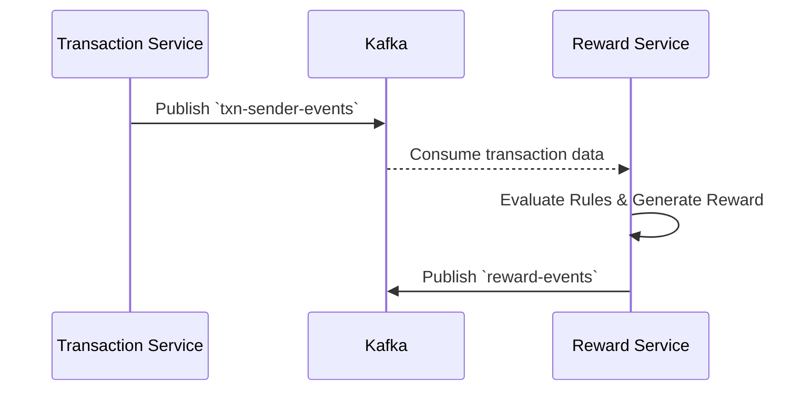

# Central Payment Ecosystem - Reward Service

Welcome to the **Reward Service**! This service provides gamification and customer retention by asynchronously issuing cashback and rewards based on user transaction behavior.

> **Explore the Ecosystem:** This repository is part of a larger microservices architecture.
> - [API Gateway](https://github.com/sarvesh873/101_Central_API-Gateway) - The central entry point and JWT verifier.
> - [Authentication Service](https://github.com/sarvesh873/101_Central_Authentication-Service) - Manages users and registration.
> - [Wallet Service](https://github.com/sarvesh873/101_Central_Wallet-Service) - Manages balances and holds.
> - **Reward Service (You are here)** - Evaluates transactions to issue rewards.
> - [Transaction Service](https://github.com/sarvesh873/101_Central_Transaction-Service) - Core engine handling two-phase commits.

---

## 🎁 Role in the Architecture

The Reward Service is completely decoupled from the critical path of a transaction. By relying on Kafka events, it ensures that even if it goes down, the core payment system is unaffected.



---

## 🚀 Features

- **Transaction Processing**: Process transactions with idempotency checks to prevent duplicate rewards.
- **Weighted Reward System**: Configurable reward rules with weighted probabilities.
- **Multi-tenant Ready**: Supports multiple users with proper isolation.
- **Event-Driven**: Kafka integration for asynchronous event processing.
- **Caching**: High-performance caching with Caffeine.
- **Containerized**: Ready for Docker and Kubernetes deployment.

### Core Components

1. **Reward Rules Engine**
   - Configurable reward tiers with weighted probabilities.
   - Support for different reward types (cashback, vouchers, points).
   - Dynamic rule management.
2. **Transaction Processor**
   - Idempotent transaction handling.
   - Reward generation based on transaction amount and rules.
3. **Claim Management**
   - Reward claiming workflow, expiration handling, and redemption code generation.
4. **Event System**
   - Kafka-based event publishing and audit trail for all reward operations.

### Database Schema

- **Reward**: Stores individual reward instances.
- **RewardRule**: Defines reward rules and their probabilities.
- **User**: User information (if not using external auth).

## 🛠️ Tech Stack

- **Framework**: Spring Boot 3.x
- **Database**: PostgreSQL
- **Caching**: Caffeine
- **Messaging**: Apache Kafka
- **API Documentation**: OpenAPI 3.0
- **Containerization**: Docker
- **Build Tool**: Maven
- **Testing**: JUnit 5, Mockito

## 🚀 Getting Started

### Prerequisites

- Java 21 or higher (Virtual Threads)
- Maven 3.8+
- Docker and Docker Compose
- Kafka & PostgreSQL

### Local Development

1. **Clone the repository**
   ```bash
   git clone https://github.com/sarvesh873/101_Central_Reward-Service.git
   cd 101_Central_Reward-Service
   ```

2. **Start dependencies**
   ```bash
   docker-compose up -d
   ```

3. **Build and run the application**
   ```bash
   mvn clean install
   mvn spring-boot:run
   ```

## 📚 API Endpoints

### 1. Process Transaction
- **POST** `/process`
  - Processes a transaction and generates a reward.
  - Idempotent operation (duplicate transaction IDs return the same reward).

### 2. Get Reward by ID
- **GET** `/{rewardId}`
  - Retrieves details of a specific reward.

### 3. Claim Reward
- **POST** `/{rewardId}/claim`
  - Claims a previously generated reward. Returns a redemption code.

### 4. Get User Rewards
- **GET** `/user/{userId}`
  - Retrieves paginated list of rewards for a user (`page` and `size`).

## 🔧 Configuration

Configuration is managed through `application.yml` with profiles for different environments:

```yaml
spring:
  datasource:
    url: ${DB_URL:jdbc:postgresql://localhost:5432/rewarddb}
    username: ${DB_USER:postgres}
    password: ${DB_PASSWORD:postgres}
kafka:
  bootstrap-servers: ${KAFKA_BOOTSTRAP_SERVERS:localhost:9092}
  topic:
    reward-events: reward-events
app:
  rate-limit:
    enabled: true
    capacity: 10
    time-window: 60
    tokens: 10
```

## 📚 API Documentation

Once the application is running, access the following:
- **Swagger UI**: http://localhost:8086/swagger-ui.html
- **OpenAPI 3.0 Docs**: http://localhost:8086/v3/api-docs

## 🧪 Testing

Run the test suite with coverage:
```bash
mvn clean test jacoco:report
```

## 🚀 Deployment

### Docker
```bash
docker build -t reward-service .
docker-compose up -d
```

### Kubernetes & Helm
```bash
kubectl apply -f k8s/
helm install reward-service ./charts/reward-service
```

## 🛡️ Security

- Rate limiting to prevent abuse
- Input validation for all API endpoints
- Kafka consumer idempotency
- Secure configuration management

## 📈 Monitoring and Logging

The service exposes Prometheus metrics at `/actuator/prometheus`.
- **Actuator Endpoints**: `/actuator/health`, `/actuator/metrics`
- **Logging**: JSON-formatted logs with Correlation IDs for request tracing.

## ✅ TODO

- [x] Add admin interface for managing reward rules
- [x] Implement topic and group names through application properties
- [x] Create admin API endpoints for reward rule management
- [ ] Add authentication and authorization for admin endpoints
- [x] Add API documentation for admin endpoints
- [x] Write unit and integration tests for new features

## 🤝 Contributing

1. Fork the repository
2. Create your feature branch (`git checkout -b feature/AmazingFeature`)
3. Commit your changes (`git commit -m 'Add some AmazingFeature'`)
4. Push to the branch (`git push origin feature/AmazingFeature`)
5. Open a Pull Request
